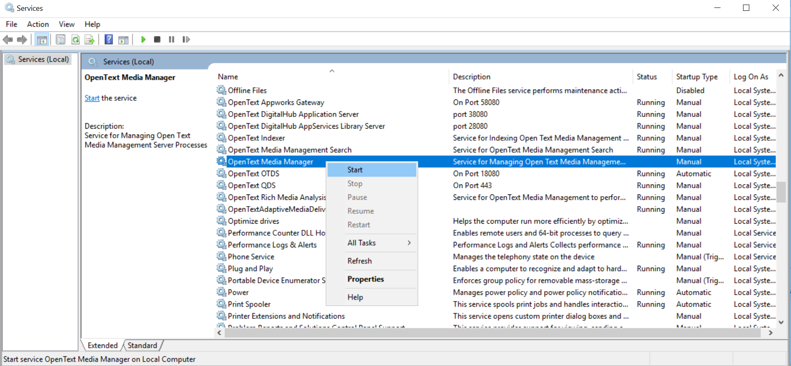
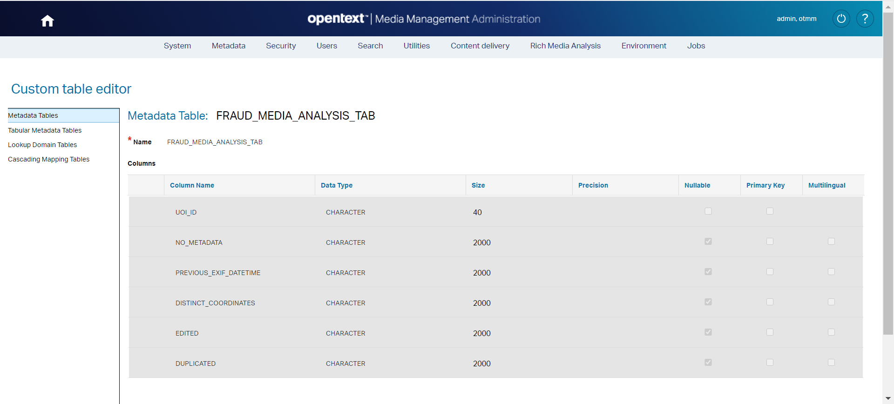

OpenText Media Management (OTMM) Event listener which listen the event **Analysis data from Azure is deleted (5006)**.
This event is launched once the Rich Media Analysis (RMA) has finished.  

> NOTE: The data from Azure is deleted regardless of whether the extraction of media analytics succeeded or not.

Once the Analysis data from Azure is deleted the transcription is available (only when the RMA has finished successfully).

This add-on makes a Fraud analysis based on metadata analysis included in a picture.

These are the criteria evaluated: 

   - **No metadata**: The picture doesn't include any metadata
   - **EXIF DateTime before of incident date**
   - **GPS coordinates distinct  Incident coordinates (from address)**
      - Use reverse geocoding to get coordinates from incident address (provided as custom metadata associated with a Crash Picture)
      - Check the distance between coordinates (should be less than 1 km)
   - **Picture edited?** Information in Exif.Image.XMLPacket* field could indicate that the picture has been edited/manipulated
     Exif.Image.XMLPacket	Byte	XMP Metadata (Adobe technote 9-14-02)
   - **Duplicated or similar picture**: Find the same picture in OTMM or one similar, in more than a 98%, means that in a reused/old picture

Each time that a picture match one of the criteria the risk score is increased in 1 unit 

If a picture has a risk score of 4 or higher a task is assigned to an Inspector to review the incident. It’s a potential fraud.

> IMPORTANT: These add-on has been developed and tested on OTMM 20.3

If some bad words are found, It are stored in this custom fields: 

 * **CUSTOM.FIELD.FRAUDANALYSIS.PICTURE.NO.METADATA**
 * **CUSTOM.FIELD.FRAUDANALYSIS.PICTURE.PREVIOUS.EXIF.DATETIME**
 * **CUSTOM.FIELD.FRAUDANALYSIS.PICTURE.DISTINCT.COORDINATES**
 * **CUSTOM.FIELD.FRAUDANALYSIS.PICTURE.EDITED**
 * **CUSTOM.FIELD.FRAUDANALYSIS.PICTURE.DUPLICATED**

> NOTE: These custom field must be created from TEAMS administration panel.

# Event handler registration
## Register event listener
1.	Copy this paragraph:

``` 
<!-- Custom event listener (Fraud Media Analysis) -->
<listener>
	<listener-class>com.opentext.otmm.sc.evenlistener.AnalysisDataFromAzureIsDeletedEventListenerRegistration</listener-class>
</listener>
```
 
2.	Open **web.xml** file located at **C:\Apps\MediaManagement\ear\artesia\otmmux\WEB-INF**
3.	Paste the paragraph under the **web-app** label

## log4j.xml

Log4j is a simple and flexible logging framework. The most common configuration options issuing  log4j.xml

Follow these steps:
1.	Copy these text:

``` 
<!-- Custom added by Joaquín -->
			
		
<logger name="com.opentext.otmm.sc.evenlistener">
	<level name="DEBUG"/>
	<appender-ref ref="console" />
	<appender-ref ref="file" />
</logger>
			
<logger name="com.opentext.otmm.sc.evenlistener.handler">
	<level name="DEBUG"/>
	<appender-ref ref="console" />
	<appender-ref ref="file" />
</logger>
			
<logger name="com.opentext.otmm.sc.evenlistener.helper">
	<level name="DEBUG"/>
	<appender-ref ref="console" />
	<appender-ref ref="file" />
</logger>
			
<logger name="com.opentext.otmm.sc.evenlistener.util">
	<level name="DEBUG"/>
	<appender-ref ref="console" />
	<appender-ref ref="file" />
</logger>
``` 

2.	Paste the paragraph before the **&lt;/log4j:configuration&gt;** label into **C:\Apps\MediaManagement_TomEE\conf\log4j.xml**


## Deploy event listener classes
1.	Open **Services** Desktop App
2.	Select **Star OpenText MediaManagement Service**
3.	Right click on **Star OpenText MediaManagement Service**
4.	Select **Stop** in order to stop the service
5.	Copy the folder structure under the **&lt;PROJECT_HOME&gt;\bin**
6.	Paste the **com** folder under **C:\Apps\MediaManagement\ear\artesia\otmmux\WEB-INF\classes**
7.	Restart  **Star OpenText MediaManagement Service** from **Services** Desktop App



# Media Management Administration

In order to store the bad words said in the video you must create some metadata.

## Create a Tabular Metadata table: FRAUD_MEDIA_ANALYSIS_TAB

1. Access to TEAMS (<OTMM_SERVER>/teams)
2. Browse to **Metadata > Custom table editor** at the top menu
3. Click on **Tabular Metadata tables** at the left menu
4. Click on **New Tabular Metadata table** button
5. Create a new table called: **FRAUD_MEDIA_ANALYSIS_TAB**
6. Add two new fields:
   * **NO_METADATA** (CHARACTER) (Nullable)
   * **PREVIOUS_EXIF_DATETIME** (CHARACTER) (Nullable)
   * **DISTINCT_COORDINATES** (CHARACTER) (Nullable)
   * **EDITED** (CHARACTER) (Nullable)
   * **DUPLICATED** (CHARACTER) (Nullable)
7. Click on **Save** button



# Required .jar files

> This section is only included to know the original location of the .jar files used in the project.

Import the indicated set of files to the indicated project folders:

**Set 1**
1. From: **C:\Apps\MediaManagement\jars**
 - artesia-server-tools.jar 
 - commons-httpclient-3.1.jar
 - commons-io-2.6.jar 
 - commons-logging-1.2.jar
 - TEAMS-common.jar
 - TEAMS-mock-services.jar
 - TEAMS-sdk.jar
 - TEAMS-toolkit.jar
 
2. To project folder: **lib**

**Set 2**
1. From: **C:\Apps\MediaManagement_TomEE\lib**
 - servlet-api.jar
 
 2. To project folder: **lib**

**Set 3**
1. From: **C:\Apps\MediaManagement\deploy\commons**
 - commons-collections-3.2.2.jar 
 - commons-collections4-4.3.jar 
 - commons-fileupload-1.3.3.jar 
 - commons-lang-2.4.jar 
2. To project folder: **lib**

**Set 4**
1. From: **C:\Apps\MediaManagement\deploy\artesia**
 - otmm-rest-interfaces.jar
 - otmm-server-ext-api.jar
2. To project folder: **lib**


**Set 4**
1. From: **C:\Apps\MediaManagement\ear\artesia.ear\**
 - artesia-ejb.jar
2. To project folder: **lib**
